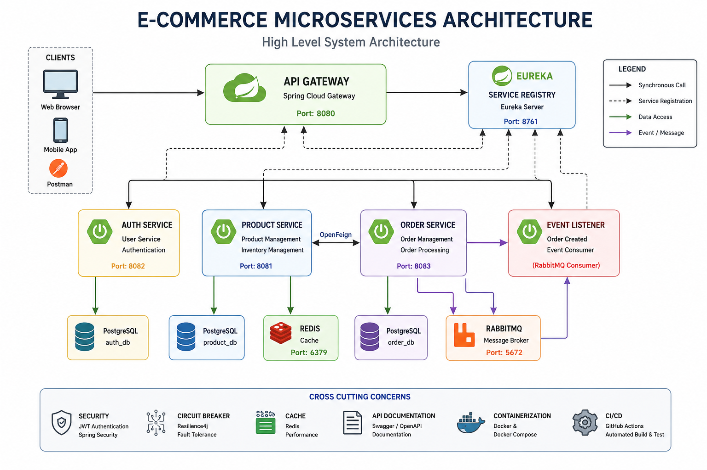
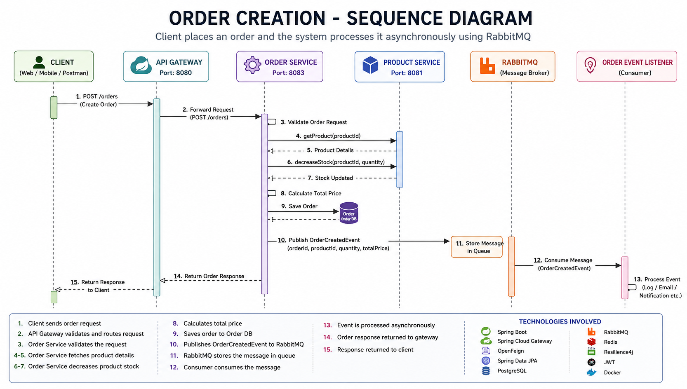
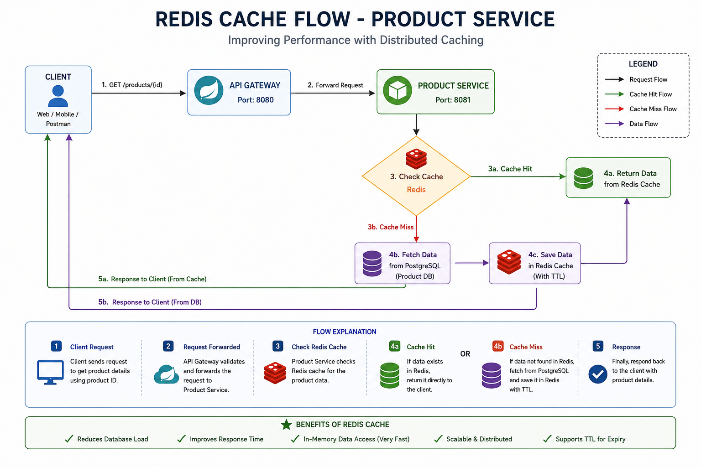
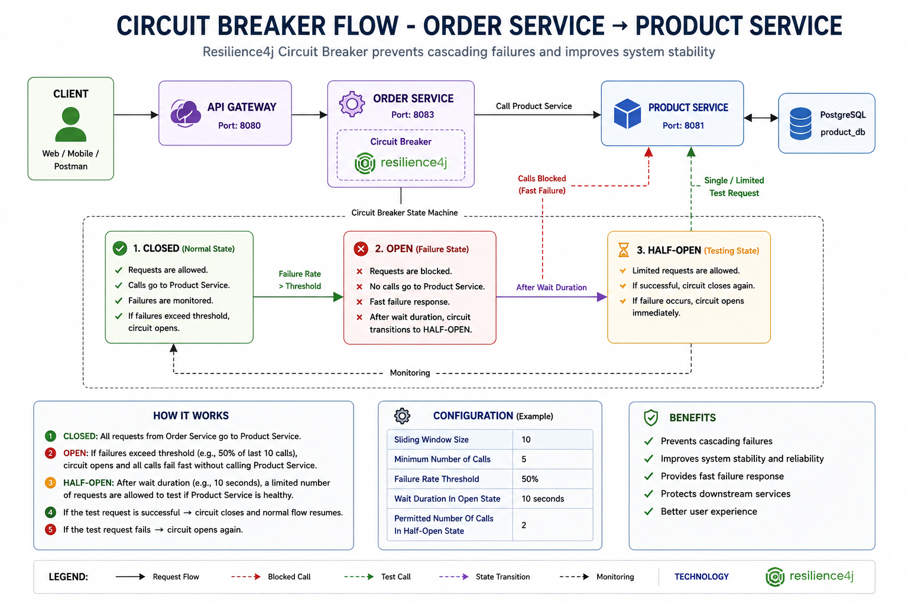
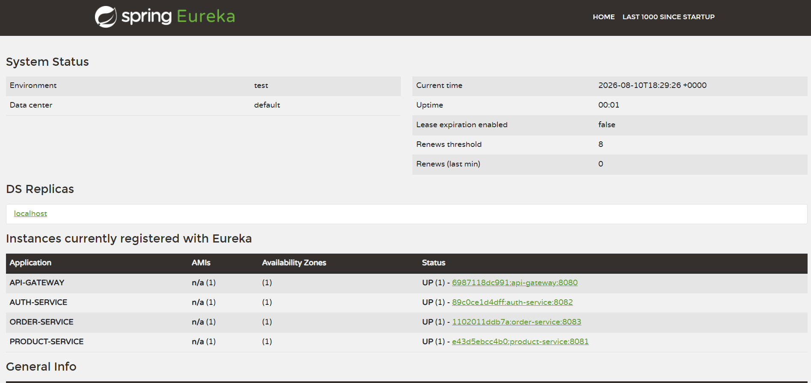
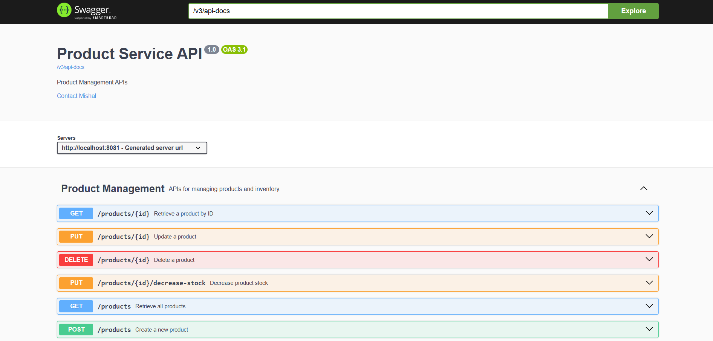
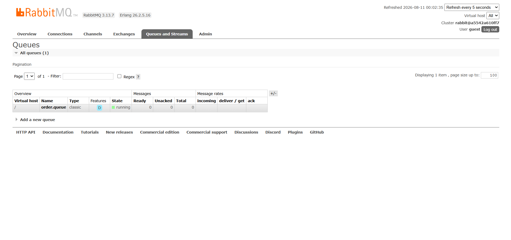
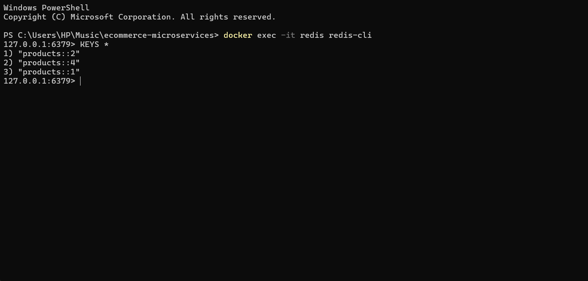
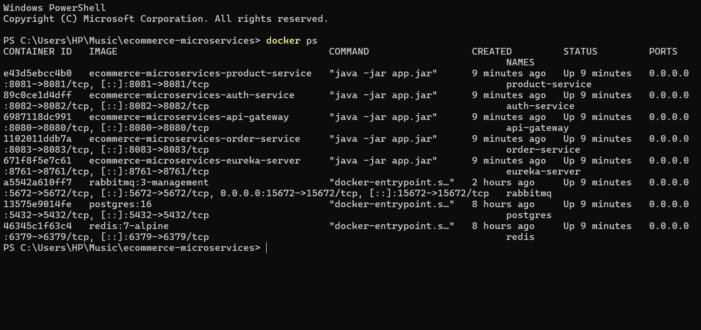
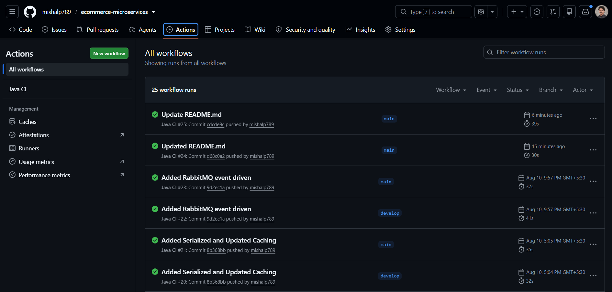

# 🛒 E-Commerce Microservices Backend


A production-style **E-Commerce Backend** built using **Java 17**, **Spring Boot 3**, and **Microservices Architecture**.

The project demonstrates real-world backend development practices including authentication, API Gateway, service discovery, inter-service communication, distributed caching, asynchronous messaging, fault tolerance, Docker, CI/CD, and automated testing.

---

# 📑 Table of Contents

- Project Overview
- Features
- Architecture
- Technology Stack
- Microservices
- Project Structure
- API Endpoints
- Authentication
- Service Communication
- Redis Cache
- RabbitMQ
- Circuit Breaker
- Docker
- Testing
- CI/CD
- Running the Project
- Future Improvements

---

# 🚀 Project Overview

This project is built using **Microservices Architecture** where every business capability is developed as an independent Spring Boot application.

Implemented services include:

- Authentication Service
- Product Service
- Order Service
- API Gateway
- Eureka Discovery Server

The services communicate using **OpenFeign** while **RabbitMQ** provides asynchronous messaging and **Redis** improves performance through caching.

---
# 🏗️ System Architecture

The backend follows a **microservices architecture** where all requests enter through the API Gateway. Services register with Eureka, communicate using OpenFeign, cache data in Redis, publish events to RabbitMQ, and persist data in PostgreSQL.

<p align="center">
  
</p>

---

# 🔄 Order Creation Sequence

The following diagram illustrates the complete lifecycle of an order, from the client request to inventory validation, order persistence, event publication, and asynchronous event consumption using RabbitMQ.

<p align="center">
  
</p>

---

# 💾 Redis Cache Flow

The Product Service uses **Redis** to cache product details. On a cache hit, the response is returned directly from Redis; on a cache miss, data is fetched from PostgreSQL, stored in Redis, and then returned to the client.

<p align="center">
  
</p>

---

# 🛡️ Circuit Breaker Flow

The Order Service uses **Resilience4j Circuit Breaker** to prevent cascading failures. When the Product Service becomes unavailable, the circuit transitions through **Closed**, **Open**, and **Half-Open** states before restoring normal traffic.

<p align="center">
  
</p>

# 📸 Application Screenshots

## Eureka Dashboard

<p align="center">
  
</p>

---

## Swagger API Documentation

<p align="center">
  
</p>

---

## RabbitMQ Dashboard

<p align="center">
  
</p>

---

## Redis Cache

<p align="center">
  
</p>

---

## Docker Containers

<p align="center">
  
</p>

---

## GitHub Actions CI

<p align="center">
  
</p>

# ✨ Features

## Authentication

- User Registration
- User Login
- JWT Authentication
- Password Encryption (BCrypt)
- Spring Security

---

## Product Management

- Create Product
- Get Product
- Update Product
- Delete Product
- Inventory Management

---

## Order Management

- Create Order
- View Orders
- Automatic Stock Deduction
- Product Validation using OpenFeign

---

## Infrastructure

- API Gateway
- Eureka Discovery Server
- OpenFeign
- Docker
- Docker Compose

---

## Production Features

- Redis Cache
- RabbitMQ Messaging
- Resilience4j Circuit Breaker
- Swagger Documentation
- Global Exception Handling
- DTO Pattern
- Mapper Pattern
- Validation

---

## Testing

- JUnit 5
- Mockito
- Service Layer Unit Tests
- GitHub Actions CI

---

# 🏗️ System Architecture

```text
                              Client
                                 │
                                 ▼
                        API Gateway (8080)
                                 │
         ┌───────────────────────┴────────────────────────┐
         ▼                                                ▼
 Product Service (8081)                         Order Service (8083)
         │                                                │
         │<------------- OpenFeign ------------------------┘
         │
         ▼
 PostgreSQL (product_db)

 Auth Service (8082)
         │
         ▼
 PostgreSQL (auth_db)

 Order Service
         │
         ▼
      RabbitMQ
         │
         ▼
 Order Event Listener

 Product Service
         │
         ▼
       Redis

          Eureka Discovery Server (8761)
```

---

# 🔄 Order Flow

```text
Client

↓

API Gateway

↓

Order Service

↓

OpenFeign

↓

Product Service

↓

Decrease Product Stock

↓

Save Order

↓

Publish Event

↓

RabbitMQ

↓

Consumer
```

---

# 💾 Cache Flow

```text
Client

↓

Product Service

↓

Redis Cache

↓

Cache Hit ?

├── Yes → Return Product

└── No

↓

PostgreSQL

↓

Save in Redis

↓

Return Product
```

---

# 🛡️ Fault Tolerance

If Product Service becomes unavailable:

```text
Order Service

↓

Circuit Breaker

↓

Fallback Method

↓

503 Service Unavailable
```

---

# 🧰 Technology Stack

| Category | Technology |
|----------|------------|
| Language | Java 17 |
| Framework | Spring Boot 3 |
| Build Tool | Maven |
| Database | PostgreSQL |
| ORM | Spring Data JPA |
| Security | Spring Security |
| Authentication | JWT |
| Discovery | Eureka |
| Gateway | Spring Cloud Gateway |
| Communication | OpenFeign |
| Cache | Redis |
| Messaging | RabbitMQ |
| Fault Tolerance | Resilience4j |
| Documentation | Swagger/OpenAPI |
| Testing | JUnit 5 |
| Mocking | Mockito |
| Containerization | Docker |
| Orchestration | Docker Compose |
| CI | GitHub Actions |

---

# 📂 Project Structure

```text
ecommerce-microservices
│
├── api-gateway
│
├── auth-service
│
├── product-service
│
├── order-service
│
├── eureka-server
│
├── docker-compose.yml
│
├── init.sql
│
├── .github
│   └── workflows
│       └── ci.yml
│
└── README.md
```

---

# 🌐 Services

| Service | Port |
|----------|------|
| API Gateway | 8080 |
| Product Service | 8081 |
| Auth Service | 8082 |
| Order Service | 8083 |
| Eureka | 8761 |
| PostgreSQL | 5432 |
| Redis | 6379 |
| RabbitMQ | 5672 |
| RabbitMQ Dashboard | 15672 |

---

# 🔐 Authentication

### Register

```
POST /auth/register
```

### Login

```
POST /auth/login
```

Returns

```json
{
    "token":"JWT_TOKEN"
}
```

Use

```
Authorization: Bearer JWT_TOKEN
```

---

# 📦 Product APIs

| Method | Endpoint |
|---------|----------|
| GET | /products |
| GET | /products/{id} |
| POST | /products |
| PUT | /products/{id} |
| DELETE | /products/{id} |
| PUT | /products/{id}/decrease-stock |

---

# 🛒 Order APIs

| Method | Endpoint |
|---------|----------|
| POST | /orders |
| GET | /orders |

---

# 📖 Swagger

```
http://localhost:8081/swagger-ui/index.html

http://localhost:8082/swagger-ui/index.html

http://localhost:8083/swagger-ui/index.html
```

---

# 🐳 Running the Project

Clone repository

```bash
git clone https://github.com/<your-username>/ecommerce-microservices.git
```

Move into project

```bash
cd ecommerce-microservices
```

Build

```bash
docker compose up --build
```

Services automatically start:

- PostgreSQL
- Redis
- RabbitMQ
- Eureka
- API Gateway
- Auth Service
- Product Service
- Order Service

---

# 🧪 Running Tests

Run all tests

```bash
mvn test
```

---

# 🔄 CI/CD

GitHub Actions automatically performs:

- Checkout Repository
- Build Services
- Execute Unit Tests
- Verify Build

---

# 📊 Implemented Design Patterns

- Layered Architecture
- DTO Pattern
- Mapper Pattern
- Repository Pattern
- Dependency Injection
- Builder Pattern

---

# 📈 Completed Features

- ✅ Authentication
- ✅ JWT
- ✅ Product CRUD
- ✅ Order Management
- ✅ Inventory Management
- ✅ OpenFeign Communication
- ✅ API Gateway
- ✅ Eureka Discovery
- ✅ Redis Cache
- ✅ RabbitMQ
- ✅ Circuit Breaker
- ✅ Docker
- ✅ Docker Compose
- ✅ Swagger
- ✅ JUnit 5
- ✅ Mockito
- ✅ GitHub Actions
- ✅ Global Exception Handling

---

# 🚀 Future Improvements

- Kubernetes Deployment
- Centralized Config Server
- ELK Logging
- Prometheus Monitoring
- Grafana Dashboard
- Notification Service
- Payment Service
- Email Service

---

# 👨‍💻 Author

**Mishal**

Java Backend Developer

### Skills Demonstrated

- Java 17
- Spring Boot
- Microservices
- Spring Security
- JWT Authentication
- Spring Cloud Gateway
- Eureka Discovery
- OpenFeign
- PostgreSQL
- Redis
- RabbitMQ
- Docker
- Docker Compose
- JUnit 5
- Mockito
- GitHub Actions
- REST APIs
- Clean Architecture

---

## ⭐ If you found this project useful, consider giving it a Star.
